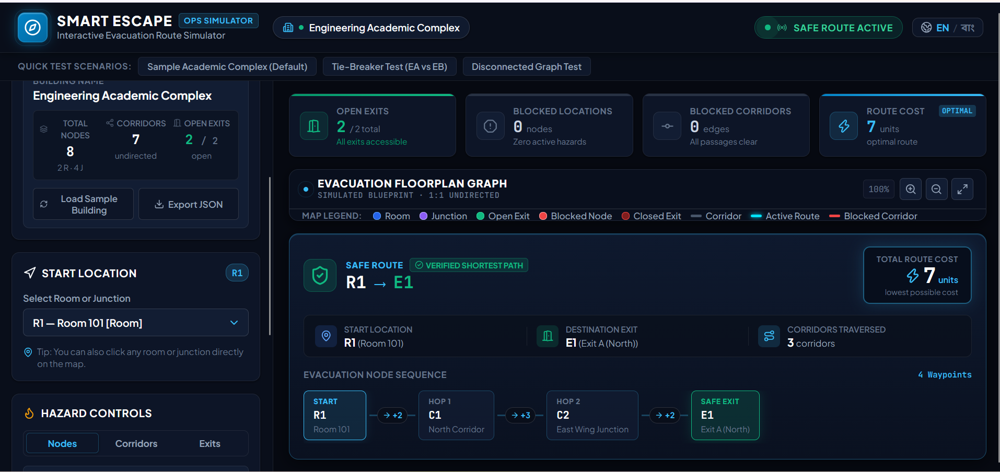
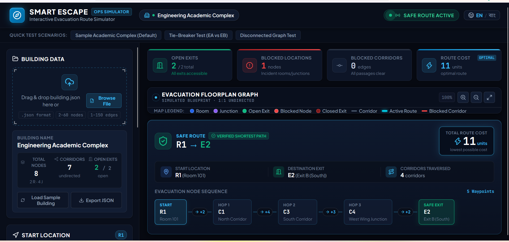

# Smart Escape — Interactive Evacuation Route Simulator

Smart Escape is an educational, interactive evacuation route simulator designed as a modern emergency operations dashboard. The application parses building floorplan data from a `building.json` file, visualizes the building as an interactive undirected weighted graph, and computes the lowest-cost evacuation path from a chosen room or junction to an accessible open exit under dynamic hazards.

---

## Participant Information

- **Name:** Rayhan Parvaz
- **Registration Number:** 242-16-007

---

## Live Demo & Repository

- **Live Application:** [https://smart-escape-seven.vercel.app/](https://smart-escape-seven.vercel.app/)
- **GitHub Repository:** [https://github.com/Rayhan1460/Smart-Escape](https://github.com/Rayhan1460/Smart-Escape)

---

## Main Features

- **Local `building.json` Import:** Seamless local file upload and drag-and-drop powered entirely by the Browser File API.
- **Strict JSON Validation:** Thorough schema and consistency verification rejecting duplicate IDs, self-loops, duplicate edges, non-integer/negative costs, out-of-bounds nodes (2–60) or edges (1–150), and invalid initial states.
- **Interactive Evacuation Floorplan Graph:** Dynamic SVG blueprint canvas with pan, zoom in/out, view reset, and high-contrast node/corridor states.
- **Weighted Shortest-Path Routing:** Accurate Dijkstra implementation calculating lowest route cost based on corridor weights (independent of visual coordinates).
- **Exact Tie-Breaking:** Deterministic tie-breaking prioritizing the lexicographically smallest Exit ID, followed by the lexicographically smallest Node ID sequence for equal-cost paths.
- **Dynamic Node Hazards:** Instant blocking and unblocking of rooms and junctions. Incident corridors to blocked nodes automatically become unusable.
- **Corridor Blocking:** Independent blocking and unblocking of individual corridors.
- **Exit Management:** Dynamic opening and closing of emergency exits.
- **Immediate Automatic Rerouting:** Real-time path recomputation upon any simulated hazard or layout state change.
- **Simulation Reset:** One-click restoration back to the exact original `initial_state` defined in the imported JSON file.
- **Bilingual Interface (English | বাংলা):** Complete language switching supporting all UI labels, statuses, instructions, controls, and error messages.
- **Responsive Emergency Operations Dashboard:** Command-center layout optimized for desktop, tablet, and mobile displays.
- **Robust Error & Failure Handling:** Explicit alerts for "Starting location blocked", "No route available", and detailed JSON schema rejection modals.

---

## Technologies

- **React 19** — Component-driven reactive user interface
- **Vite 8** — Fast frontend development environment and production bundler
- **JavaScript (ES2022+)** — Pure client-side application logic and graph algorithms
- **Vanilla CSS** — Custom design system, responsive layouts, and command-center styling
- **Browser File API** — Secure client-side file reading without server uploads
- **Lucide React** — Clean, accessible tactical UI icons

---

## Local Setup

### 1. Install Dependencies
```bash
npm install
```

### 2. Run the Development Server
```bash
npm run dev
```

Open [http://localhost:5173](http://localhost:5173) in your browser.

---

## Production Build

To build the static application bundle for production:

```bash
npm run build
```

The optimized static files will be generated in the `dist/` directory, ready for static hosting (e.g., Vercel, Netlify, GitHub Pages).

---

## Testing

An automated verification test suite is included in the project:

```bash
node test_suite.js
```

### Verification Coverage:
- **Baseline Scenario 1:** Start at `R1` → Route: `R1 -> C1 -> C2 -> E1` (Cost: 7, Corridors: 3)
- **Reroute Scenario 2:** Start at `R1`, block `C2` → Route: `R1 -> C1 -> C3 -> C4 -> E2` (Cost: 11, Corridors: 4)
- **Failure Scenario 3:** Start at `R1`, close `E1` and `E2` → `No route available`
- **Alternative Start Scenario 4:** Start at `R2` → Route: `R2 -> C3 -> C4 -> E2` (Cost: 7, Corridors: 3)
- **Compromised Origin Scenario 5:** Start at `R1`, block `R1` → `Starting location blocked`
- **Tie-Breaking Verification:** Validates lexicographically smallest exit ID and path node ID sequence selection on equal-cost paths.
- **Disconnected Graph Handling:** Ensures disconnected graphs are accepted as valid schema and unreachability is handled gracefully.
- **Malformed JSON Handling:** Validates strict rejection of self-loops, duplicate edges, missing required node types, and invalid cost values.

---

## Screenshots


*Baseline Route — R1 → C1 → C2 → E1, Total Cost: 7*


*Dynamic Rerouting — C2 blocked, R1 → C1 → C3 → C4 → E2, Total Cost: 11*

---

## AI Tools Used

- **Google Antigravity** — Used as an AI pair-programming assistant for implementation, routing algorithm verification, UI/UX refinement, test suite generation, and documentation.

---

## Most Useful Prompt

```text
Build a frontend-only educational interactive evacuation route simulator in React + Vite called Smart Escape. The app must import a local building.json file, strictly validate its schema (2-60 nodes, 1-150 undirected edges, positive integer costs, no self-loops, no repeated edge pairs, initial_state), render an interactive SVG floorplan graph, and compute the lowest-cost evacuation path from an unblocked room/junction to an accessible open exit using Dijkstra with exact tie-breaking (lexicographically smallest Exit ID, then smallest Node ID sequence). Dynamically recalculate routes when nodes/corridors/exits are blocked or closed. Provide reset to initial_state, failure states ('Starting location blocked', 'No route available'), English/বাংলা bilingual switching, and a polished command-center emergency operations dashboard using Vanilla CSS. Do not use any backend, database, or external APIs.
```

---

## Known Issues / Limitations

No known critical issues.

---

## License

This project is licensed under the [MIT License](LICENSE).
